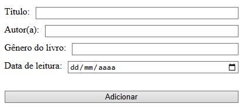
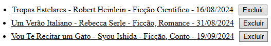
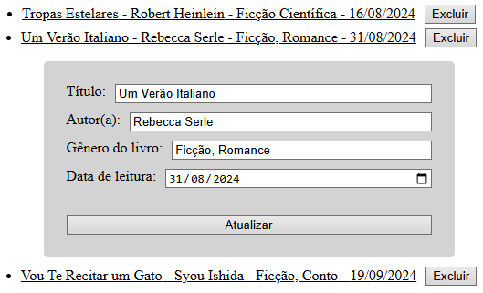
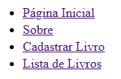
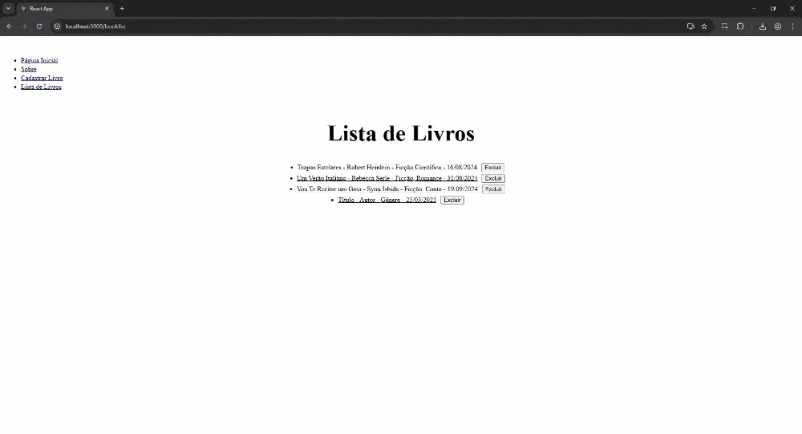

# Reading Journal

Esta é uma aplicação para um CRUD de um diário de leitura. Este projeto foi elaborado na disciplina de Desenvolvimento de Sistemas Frontend, do curso de Análise e Desenvolvimento de Sistemas da PUCRS, 5° trimestre.

## Como Subir o Projeto

Para fazer o projeto funcionar no seu computador, certifique-se de que você possui o Git e o Node instalados.   
Estando tudo certo, descompacte o arquivo .zip ou, caso esteja vendo este projeto através do GitHub, execute o comando `git clone https://github.com/JoaoVitorRP/Reading-Journal.git` na pasta desejada.  
Após isso abra o console de sua IDE ou de seu Sistema Operacional, navegue até a pasta em que o projeto se encontra e execute o comando `npm install`.   
Quando as dependências tiverem terminado de instalar, o projeto estará pronto para rodar em seu navegador usando o comando `npm start`.

## Explicação dos componentes

### BookForm.js

Este componente contém o formulário para o cadastro de novos livros, e recebe via props `bookList`, `setBookList`, `currentId` e `setCurrentId`. 
Os valores do formulário são armazenados em um estado `form` em forma de objeto e, quando o usuário clica no botão de "Adicionar", adiciona uma nova entrada ao array de objetos `bookList`. 
Possui validações simples, como não permitir que o usuário adicione espaços em branco no início dos inputs e um input com `type="date"` no campo de data.

### BookList.js

Este componente contém a lista de livros, e recebe via props `bookList`, `setBookList` e `currentId`. 
O componente pega a `bookList` e faz um `map`, retornando a cada item um componente de lista `li` contendo as informações do livro e um botão para excluir aquele livro. Ao clicar para excluir, o componente faz um `filter`, tirando da `bookList` o objeto que possui id igual ao id do livro que se deseja excluir.

 

Também é possível clicar no texto sublinhado, abrindo uma caixa de formulário que permite editar as informações daquele livro. Ao clicar em "Atualizar", um novo item de lista é criado, excluindo o antigo.

### NavBar.js

Este componente contém os links de navegação da página. 
Cada item da lista possui um `Link` do pacote `react-router-dom` que contém o link de navegação para a respectiva página.

## Demonstração de Uso

### Navegação

### Cadastro de Livros

### Editar e Excluir Livros

## Considerações Finais

Obrigado por usar a minha aplicação! Espero que você goste :)
