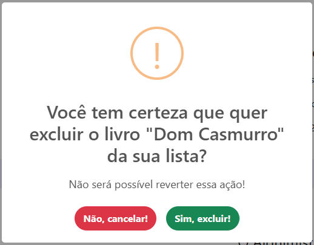
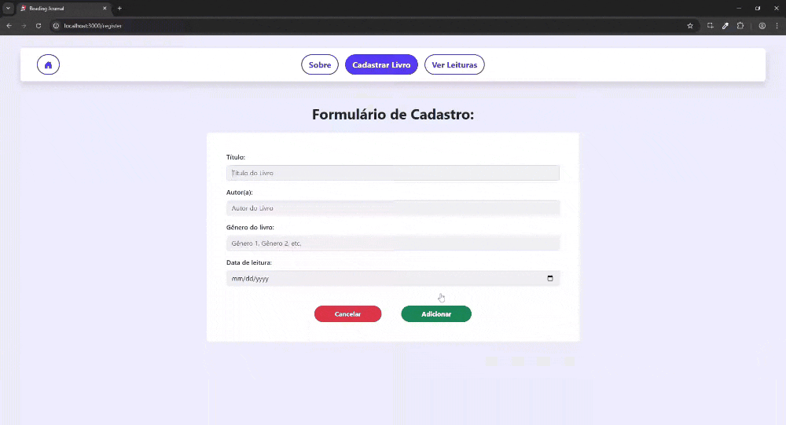

# Reading Journal

Esta é uma aplicação para um CRUD de um diário de leitura. Este projeto foi elaborado na disciplina de Desenvolvimento de Sistemas Frontend, do curso de Análise e Desenvolvimento de Sistemas da PUCRS, 5° trimestre.

<b>Desenvolvido por:</b> João Vitor Ribeiro Pereira

<b>Tecnologias utilizadas:</b>

## Como Subir o Projeto

Para fazer o projeto funcionar no seu computador, certifique-se de que você possui o Git e o Node instalados.

Estando tudo certo, descompacte o arquivo .zip, ou, caso esteja vendo este projeto através do GitHub, execute o comando `git clone https://github.com/JoaoVitorRP/Reading-Journal.git` na pasta desejada.

Você também precisará do back-end, que se encontra em <a href="https://github.com/adsPucrsOnline/DesenvolvimentoFrontend/">https://github.com/adsPucrsOnline/DesenvolvimentoFrontend/</a>. 
Para executar a API:

<ul>
<li>Clone o repositório localmente</li>
<li>Utilizando o mesmo terminal, entre na pasta da API: <code>cd ./DesenvolvimentoFrontend/readingJournal-api/</code></li>
<li>Execute <code>npm install</code> e em seguida <code>npm start</code></li>
</ul>

<b>OBS:</b> ao rodar a API, ela deverá estar na URL `http://localhost:5000/`. Caso esteja em outra URL, isso deverá ser ajustado no projeto (em `src/services/api/api.js`) e dentro dos testes que a utilizam (em `cypress/tests/e2e/*`).

Após isso abra o console de sua IDE ou de seu Sistema Operacional, navegue até a pasta em que o projeto frontend se encontra, e execute o comando `npm install`.

Quando as dependências tiverem terminado de instalar, o projeto estará pronto para rodar em seu navegador usando o comando `npm start`.

## Testes

Este projeto conta com uma série de testes end-to-end desenvolvidos em <a href="https://www.cypress.io">Cypress</a>, que verificam todas as funcionalidades do projeto e sua integração com o back-end.

Para rodar os testes, garanta que tanto o frontend quanto o backend estejam rodando localmente (ver seção <a href="#como-subir-o-projeto">#Como Subir o Projeto</a>). Feito isso, na pasta do projeto frontend execute o comando `npm test`. Você conseguirá ver os testes rodando no console e, ao final, poderá ver quais passaram e quais falharam.

Caso deseje uma interface mais visual e que lhe permita escolher quais testes rodar, execute o comando `npx cypress open` ao invés do anterior.

## Explicação dos componentes

### BookForm.js

Este componente contém o formulário para o cadastro de novos livros, e recebe via props `bookToEdit`, `setBookToEdit`, `setUpdateHappened`. 
Os valores do formulário são armazenados em um estado (useState) `formDate` em forma de objeto e, quando o usuário clica no botão de "Adicionar", se comunica com o back-end e adiciona um novo livro à lista de leitura. 
Em caso de sucesso, aparece um alerta com a mensagem de que o livro foi adicionado. Em caso de erro, também aparece um alerta, mas com a mensagem de erro retornada pelo backend. 
Caso o usuário clique em "Cancelar", os campos do formulário são limpos e o livro não é adicionado à lista 
Possui validações simples, como não permitir que o usuário adicione espaços em branco no início dos inputs e um input com `type="date"` no campo de data.

### BookList.js

Este componente contém a lista de livros, e recebe via props `bookList` e `setUpdateHappened`. 
O componente pega a `bookList` e faz um `map`, retornando a cada item uma `div` contendo as informações do livro, um botão para editar e um botão para excluir aquele livro.

Ao clicar para editar, o componente adiciona as informações do livro a ser editado no estado (useState) `booToEdit`. Isso permite que se abra junto à `div` um componente `BookForm`. Ele conterá as informações já presentes no livro, onde o usuário poderá editar e confirmar ou cancelar (o que fecha o formulário).  
Caso escolha confirmar a edição, é realizado um `PUT` no backend e, em caso de sucesso, aparece um alerta com a mensagem de que que o livro foi editado. Em caso de erro, também aparece um alerta, mas com a mensagem de erro retornada pelo backend. 
Caso escolha cancelar a edição, o formulário é fechado e nenhuma comunicação com o backend ocorre. 
<b>OBS:</b> Apenas um formulário de edição será aberto por vez. Caso você tenha um aberto e clique para editar outro livro, o primeiro formulário será fechado e o outro será aberto.

Ao clicar para excluir, abre-se um modal de confirmação da exclusão. Caso o usuário opte por confirmar, é enviada uma requisição `DELETE` ao backend, com o id daquele livro. Em caso de sucesso, um modal com a mensagem de que aquele livro foi excluído é aberto. Em caso de erro, aparece um alerta com a mensagem de erro retornada pelo backend.  
Caso o usuário opte por cancelar, nenhuma comunicação com o backend ocorre e o livro não é excluído.

Tanto o sucesso da edição quanto o da exclusão irão disparar o estado `updateHappened`, que fará com que a página busque a lista de livros novamente, contendo as informações atualizadas ou a lista sem o livro que foi excluído.

### NavBar.js

Este componente, que fica fixo no topo da página, contém os links de navegação da página, e recebe por props todos os elementos da página (`props.children`). 
Cada item da lista possui um `Link` do pacote `react-router-dom` que contém o link de navegação para a respectiva página.  
Ao navegar para uma página, o botão correspondente ficará roxo e desativado. Ao passar o mouse por cima de um botão de navegação, ele ficará roxo clarinho.

## Demonstração de Uso

### Navegação

### Cadastro de Livros

### Editar Livros

### Excluir Livros

## Considerações Finais

Obrigado por usar a minha aplicação! Espero que você goste :)
